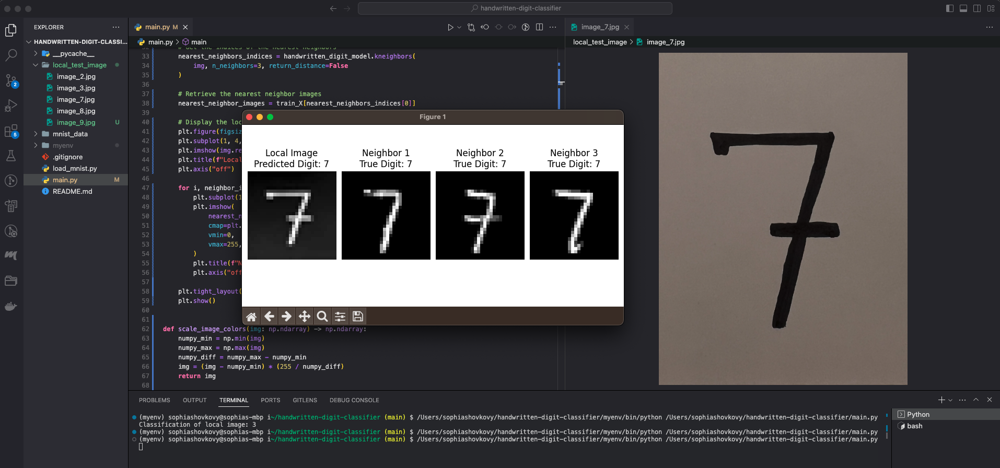

# Week 1

<span style="opacity: 0.5;">09/18/2023 - 09/22/2023</span>

This week was my first week at [Recurse Center](https://www.recurse.com), a 12-week programming retreat for developers. The retreat provides a collaborative space for programmers to challenge themselves and “work at the edge of their abilities.” It operates on an entirely self-directed basis, so no classes or curriculums to follow. Individuals are responsible for creating their own schedules, brainstorming projects, and learning generously.

## Self-directed Structure

I started the week with a virtual onboarding and getting to meet my batch mates. The first two days of the program are virtual for everyone, and then the hub opens for in-person participants. I find it hard to make meaningful connections via Zoom, so I focused my first two days on my own setup - including finding streams (Zulip’s version of Slack channels) that were interesting to me, scanning the calendar for groups I want to be a part of, and setting up the structure of how I intend to spend RC days.

I determined 3 structural goals for any RC day:

1. Workout before 9am
2. Six hours of deep work
   - Includes time for learning, coding, and pair programming
   - Does not include email, errands, or walks
3. Post a daily check-in every weekday and write a weekly report (this) every Thursday.

Six hours is what works for me. Some may choose to do more, but I’ve noticed that deep work for me gets less productive past that and I lose creative energy, which is a valuable commodity in a self-directed study.

## ML Intensive

I decided that my first focus at RC was going to be an ML intensive. A chance to learn the fundamentals, pair with experienced ML engineers, and build a few models.

I jumped in with [Karpathy’s Neural Networks: Zero to Hero](https://karpathy.ai/zero-to-hero.html) series but after the first lecture I craved something more hands-on and decided to break up watching the lectures with an interactive [Intro to Machine Learning](https://www.kaggle.com/learn/intro-to-machine-learning) course. It's simpler and less detailed than Karpathy's lectures, but a good way to get warmed up.

I use Obsidian for note taking, which I recommend if you're studying something terminology-heavy and enjoy taking notes.

If you’re a visual person like me, Obsidian’s graphs feature helps new concepts take shape and have meaning in relation to other ideas.

## Handwritten Digit Classifier Using the KNN Algorithm and MNIST Dataset

[Github Repo](https://github.com/sshovkov/handwritten-digit-classifier)

For my first ML project, I decided to build a handwrittten digit classification model using the MNIST dataset, a project that seems to be a right of passage for engineers that set out to learn ML.

I was able to fairly quickly get an implementation of a KNN model off the ground, trained and tested on the MNIST dataset.

Since a model is only as good as it's ability to actually predict new input, so I set out to expand it to take a local image as input, process it, and accurately classify it. I also wanted to display it to the user, along with its nearest 3 neighbors.

Having had no prior experience with image processing, this ended up being a fun challenge.

My initial implementation kept misclassifying all my handwritten digits as a "1". At some point I printed the NumPy array of my input image and a random `train_image`, which is when I came across my two big bugs -

1. The pixel values in `train_image[0]` were in the range [0, 255] but while processing my image I was mistakenly scaling down the pixel values to [0, 1]
2. The input image didn’t have any “low” pixel values. The min pixel value in my image was around 109. I realized that in processing my image, I had failed to consider how the model would react to different ranges. The solution was to scale the colors of the input image to [0, 255].

```python
def scale_image_colors(img: np.ndarray) -> np.ndarray:
    """
    Scale the colors of an image to be between 0 and 255 for accurate model prediction.
    """
    img_RGB_range = img.max() - img.min()
    img = (img - img.min()) * (255 / img_RGB_range)
    return img
```

The end result was a KNN model that successfully classifies a handwritten digit with 97.05% accuracy 🎉

