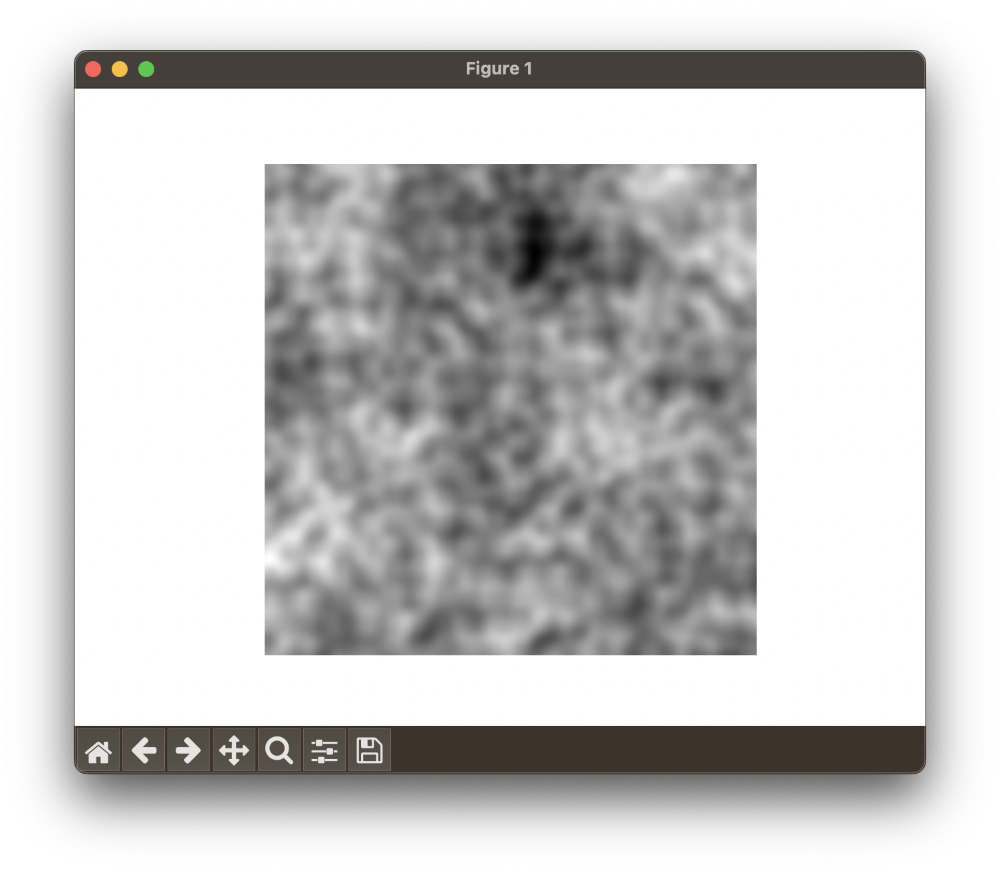

# Week 2

<span style="opacity: 0.5;">09/25/2023 - 09/29/2023</span>

## The Brooklyn Hub

This week I started going in-person to the Recurse Center hub. The hub occupies two floors in a spacious building in Downtown Brooklyn and you can tell the space is thoughtfully designed and curated, dedicated to making you feel creative and inspired.

There’s a computer lab with working computers from the '80s and '90s, a closet full of spare hardware for tinkering, a library with every computer-related book imaginable, a power nap corner, a full kitchen, and of course tons of desks (with monitors and keyboards) for heads-down work or pair programming.

## Setting Up This Repo

When I was first researching RC, I came across several blogs from former Recursers that helped shape my understanding of the program and made me excited about the opportunity. I found it energizing to read other people's accounts of what they built, how, and why.

Special s/o to these blogs -

- [Nicole Tietz](https://ntietz.com/tags/recurse-center/)
- [Andrew Healey](https://healeycodes.com/my-time-at-the-recurse-center)
- [Julia Evans](https://jvns.ca/blog/2017/09/17/how-i-spent-my-time-at-the-recurse-center/)
- [Kai Wern](https://kaiwern.com/posts/2022/05/12/first-6-weeks-in-the-recurse-center/)
- [Kofi Gumbs](https://kofi.sexy/blog/rc-2019)

I want to make sure to document my projects and growth too, and maybe it will be helpful for someone else in the future.

I decided to use a GitHub repo for journaling primarily because I love markdown and didn't want building a portfolio website to be one of my focal points at RC. Getting a custom-built blog into a place that met my standards was definitely going to take up valuable time, so I ultimately decided to use a platform that I knew well and supported code. I didn't want where I documented my growth to be a blocker for actually getting it done.

## Quality through quantity (#PoundsOfClay)

I came across a phrase, "pounds of clay", that refers to a learning approach traced back to a [short excerpt](https://hci.stanford.edu/dschool/resources/prototyping/pots.html) from _Art & Fear: Observations On the Perils (and Rewards) of Artmaking_.

> The ceramics teacher announced on opening day that he was dividing the class into two groups. All those on the left side of the studio, he said, would be graded solely on the quantity of work they produced, all those on the right solely on its quality. His procedure was simple: on the final day of class he would bring in his bathroom scales and weigh the work of the "quantity" group: fifty pound of pots rated an "A", forty pounds a "B", and so on. Those being graded on "quality", however, needed to produce only one pot -- albeit a perfect one -- to get an "A". Well, came grading time and a curious fact emerged: the works of highest quality were all produced by the group being graded for quantity. It seems that while the "quantity" group was busily churning out piles of work - and learning from their mistakes -- the "quality" group had sat theorizing about perfection, and in the end had little more to show for their efforts than grandiose theories and a pile of dead clay.

In the startup world, everyone talks about how perfect is the enemy of done. This is true, but a good MVP is not a lot of things done, it's a few things done perfectly.

I'm known for my ability to polish a project, to hone in on the details until they are exactly how I want them to be.

While I still believe in that level of detail, I want my limited time at RC to be about getting my hands dirty with a variety of topics and challenging my approach to problems and idea generation. As a result, #PoundsOfClay is the mindset I'm adopting, more or less.

## Building a VSCode Extension - `SwapCode`

[GitHub Repo](https://github.com/sshovkov/swapcode-vscode-extension)

Rearranging code in a file is a natural part of development. There are a number of code-swapping extensions for VSCode, but none that I have found to work intuitively.

In the spirit of #PoundsOfClay, I decided to time-block 1.5 hours for building my own (and first) VSCode extension to handle this.

The goal: move selected text into clipboard, and clipboard contents into editor. And with an intuitive keyboard shortcut, not the command palette.

The implementation was pretty straightforward since it was a simple swap and [VSCode's documentation](https://code.visualstudio.com/api/get-started/your-first-extension) was easy to follow.

I was able to complete the implementation in about 45 minutes and set up publishing in about 20 minutes.

Ta-da. [Swap Code](https://marketplace.visualstudio.com/items?itemName=SophiaShovkovy.swapcode).

## A Fractal Noise Generator

[GitHub Repo](https://github.com/sshovkov/fractal-noise-generator)

One of my focus areas for RC is experimenting with generative art, and I came across Perlin Noise while going down a rabbit hole of procedural texture generation.

Perlin noise is a procedural texture primitive, a type of gradient noise used in visual effects to increase the appearance of realism in computer graphics.

Multiple layers of Perlin Noise produce Fractal Noise, a noise pattern commonly used to create complex and natural-looking patterns like clouds, fire, or terrain.

To build a Fractal Noise generator, I mainly understood the task as

1. Create variables for fractal noise factors, like octaves and scale
2. Create Perlin Noise for every layer (octave) using Python's [perlin-noise](https://pypi.org/project/perlin-noise/) library

For a v1 of the generator, I defined the fractal noise parameters as

```
width, height = (512, 512)
scale = 0.1
persistence = 0.65
octaves = 6
```

- `width` / `height`: the dimensions of the image in pixels where the fractal noise will be generated
- `scale`: controls the size of the features in the noise pattern
- `persistence`: controls how much each successive octave contributes to the final noise pattern
- `octaves`: the number of layers of noise to be combined to create the final pattern

To generate the Fractal Noise pattern I...

1. Initialized a `width`x`height` NumPy array `noise` with 0's
2. For each octave, generated Perlin Noise
3. For each octave, retrieved the corresponding pixel value of the generated Perlin Noise for each normalized coordinate in `height`x`width`

The end result looks something like this -


For a v2, I'm planning to turn this generator into a Python library and add a gradient overtop or apply it to an input image.
