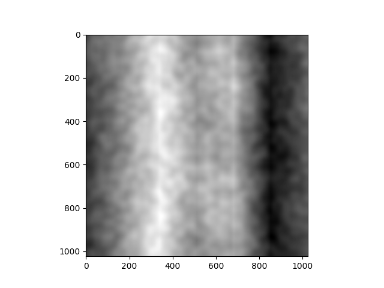
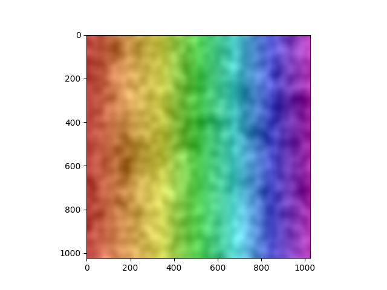

# Week 3

10/02/2023 - 10/06/2023

## Creating Mini Python libraries

### fractal-noise

[Install fractal-noise](https://pypi.org/project/fractal-noise/)

[GitHub Repo for fractal-noise](https://github.com/sshovkov/fractal-noise-package)

To build on [last week's fractal noise generator](https://github.com/sshovkov/recurse-center-journal/blob/main/Week2.md#a-fractal-noise-generator), I set out to convert it into a working Python library and publish it. I followed [PyPI's documentation](https://packaging.python.org/tutorials/packaging-projects/) to create the required file and folder structure, as well as how to build and publish the package.

In the process of making this a scalable package, I decided to be a responsible contributor and create a test suite. The tests helped me uncover that my original implementation did not work for non-square dimensions. I was encountering an out-of-bounds error because I was creating the noise array with dimensions (width, height) but accessing it as noise[y, x]. This effectively was transposing square arrays (used in hand testing) but failed for non-square dimensions. It was an easy fix and I'm glad my tests helped uncover this bug.

Once the package was successfully published, I installed it in a new project directory and tested its abilities by generating and applying the fractal noise pattern to a local image.

| Original Image                         | With Fractal Noise                          | With Fractal Noise (color)                        |
| -------------------------------------- | ------------------------------------------- | ------------------------------------------------- |
|  |  |  |

### showme-tree

[Install showme-tree](https://pypi.org/project/showme-tree/)

[GitHub Repo for showme-tree](https://github.com/sshovkov/showme-folder-structure)

One of the group sessions I attended at RC was discussing the power of debugging with OpenAI's ChatGPT. Unlike Stack Overflow, ChatGPT provides possible solutions directly applicable to your project and saves you the time and effort of translating someone else's files, folders, and variable names into your own.

One method I've found especially helpful when debugging certain issues with ChatGPT is providing it with my file and folder structure from the getgo so it can provide assistance with high-context on my project.

This led to building a Python script that prints the structure of a VSCode project while ignoring nested items of contents specified in a `.gitignore` file if it exists.

The script finds the root directory of the project by searching for a `.git` directory or asking the user to manually input the path if the project is not a version-controlled Git project. The script recursively explores the project directory, printing its structure and excluding nested files and directories of the contents specified in `.gitignore`, which is parsed with the `gitignore_parser` library if it exists.

## Experimenting with Google's MediaPipe

[GitHub Repo](https://github.com/sshovkov/finger-painting-hand-recognition-model)

I started this week playing around with Google's MediaPipe library and seeing what it can do with hand recognition. I started with an implementation of the [Hand Landmarker](https://developers.google.com/mediapipe/solutions/vision/hand_landmarker/python) with Python. Using OpenCV for video capture and drawing, I painted a green circle at each landmark to visualize tracking.

to be continued...
